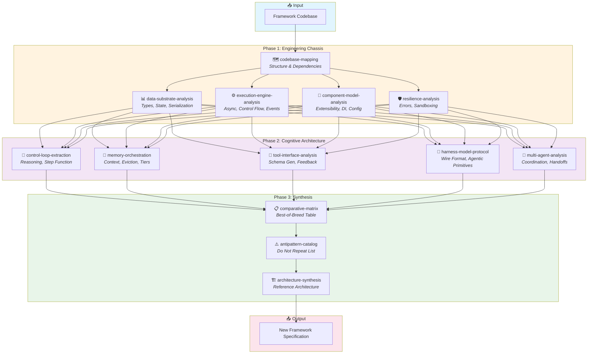

```mermaid
flowchart TB
    subgraph Input["📥 Input"]
        FW["Framework Codebase"]
    end

    subgraph Phase1["Phase 1: Engineering Chassis"]
        CM["🗺️ codebase-mapping<br/><i>Structure & Dependencies</i>"]
        DS["📊 data-substrate-analysis<br/><i>Types, State, Serialization</i>"]
        EE["⚙️ execution-engine-analysis<br/><i>Async, Control Flow, Events</i>"]
        CO["🧩 component-model-analysis<br/><i>Extensibility, DI, Config</i>"]
        RE["🛡️ resilience-analysis<br/><i>Errors, Sandboxing</i>"]
    end

    subgraph Phase2["Phase 2: Cognitive Architecture"]
        CL["🔄 control-loop-extraction<br/><i>Reasoning, Step Function</i>"]
        MO["🧠 memory-orchestration<br/><i>Context, Eviction, Tiers</i>"]
        TI["🔧 tool-interface-analysis<br/><i>Schema Gen, Feedback</i>"]
        HM["📡 harness-model-protocol<br/><i>Wire Format, Agentic Primitives</i>"]
        MA["👥 multi-agent-analysis<br/><i>Coordination, Handoffs</i>"]
    end

    subgraph Phase3["Phase 3: Synthesis"]
        MT["📋 comparative-matrix<br/><i>Best-of-Breed Table</i>"]
        AP["⚠️ antipattern-catalog<br/><i>Do Not Repeat List</i>"]
        AS["🏗️ architecture-synthesis<br/><i>Reference Architecture</i>"]
    end

    subgraph Output["📤 Output"]
        SPEC["New Framework Specification"]
    end

    FW --> CM
    CM --> DS & EE & CO & RE
    DS & EE & CO & RE --> CL & MO & TI & HM & MA
    CL & MO & TI & HM & MA --> MT
    MT --> AP --> AS
    AS --> SPEC

    style Input fill:#e1f5fe
    style Phase1 fill:#fff3e0
    style Phase2 fill:#f3e5f5
    style Phase3 fill:#e8f5e9
    style Output fill:#fce4ec
```
