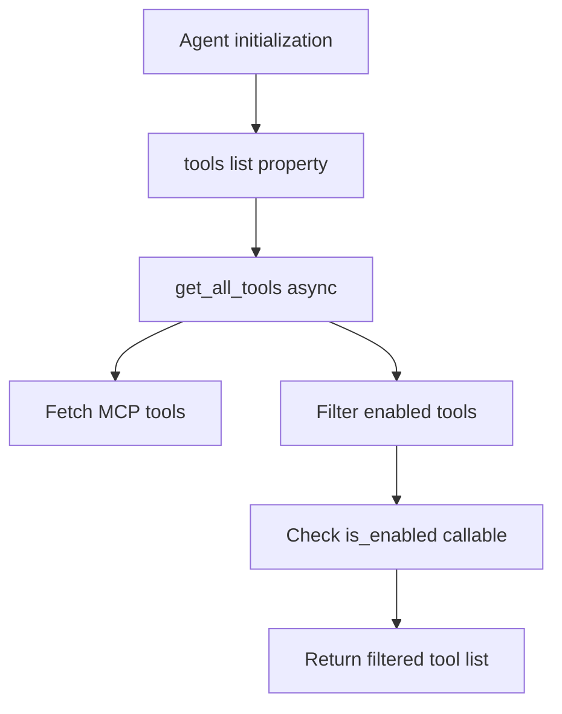

# Tool Interface Analysis: openai-agents-python

## Summary
- **Tool Modeling**: Decorator-based FunctionTool + dataclass-based hosted tools
- **Schema Generation**: Function introspection + Pydantic model generation + strict mode conversion
- **Registration Pattern**: Declarative list-based registration with dynamic enablement
- **Error Handling**: Three-tier system (exceptions, error functions, guardrails)
- **Built-in Tools**: 10+ tools across 4 categories (function, hosted, local, OpenAI-native)

## Tool Modeling

### Core Abstraction

The framework uses a **union type approach** with multiple tool types:

```python
# From src/agents/tool.py (lines 656-667)
Tool = Union[
    FunctionTool,              # Decorated Python functions
    FileSearchTool,            # OpenAI hosted vector search
    WebSearchTool,             # OpenAI hosted web search
    ComputerTool[Any],         # Computer control (browser/desktop)
    HostedMCPTool,             # Model Context Protocol remote servers
    ShellTool,                 # Shell command execution
    ApplyPatchTool,            # File editing via unified diffs
    LocalShellTool,            # Local shell (deprecated, use ShellTool)
    ImageGenerationTool,       # OpenAI image generation
    CodeInterpreterTool,       # OpenAI code execution
]
```

### FunctionTool (Primary Tool Type)

```python
# From src/agents/tool.py (lines 194-241)
@dataclass
class FunctionTool:
    name: str
    """The name of the tool, as shown to the LLM."""

    description: str
    """A description of the tool, as shown to the LLM."""

    params_json_schema: dict[str, Any]
    """The JSON schema for the tool's parameters."""

    on_invoke_tool: Callable[[ToolContext[Any], str], Awaitable[Any]]
    """A function that invokes the tool with context and JSON string arguments."""

    strict_json_schema: bool = True
    """Whether the JSON schema is in strict mode (strongly recommended)."""

    is_enabled: bool | Callable[[RunContextWrapper[Any], AgentBase], MaybeAwaitable[bool]] = True
    """Whether the tool is enabled (static bool or dynamic callable)."""

    tool_input_guardrails: list[ToolInputGuardrail[Any]] | None = None
    """Optional list of input guardrails."""

    tool_output_guardrails: list[ToolOutputGuardrail[Any]] | None = None
    """Optional list of output guardrails."""
```

### Key Attributes

| Attribute | Type | Purpose |
|-----------|------|---------|
| name | str | Tool identifier shown to LLM |
| description | str | Natural language description for LLM |
| params_json_schema | dict | JSON schema for parameters (auto-generated) |
| on_invoke_tool | async callable | Execution handler receiving ToolContext + JSON args |
| strict_json_schema | bool | Enable OpenAI strict mode (default: True) |
| is_enabled | bool or callable | Static or dynamic tool availability |
| tool_input_guardrails | list | Pre-execution validation hooks |
| tool_output_guardrails | list | Post-execution validation hooks |

### Context Injection Pattern

The framework supports **three function signatures** for context injection:

```python
# From tool-context.md (lines 15-18)
# 1. No context
def tool(arg: str) -> str:
    return process(arg)

# 2. RunContext (generic agent context)
def tool(context: RunContext, arg: str) -> str:
    return process_with_context(context, arg)

# 3. ToolContext (tool-specific context with call metadata)
def tool(context: ToolContext, arg: str) -> str:
    # Access tool_name, tool_call_id, tool_arguments
    return process_with_tool_info(context, arg)
```

Detected automatically via **signature introspection** (src/agents/function_schema.py:279-302).

## Schema Generation

### Method Used

**Three-stage process**:
1. **Function introspection** via `inspect.signature()`
2. **Pydantic model generation** via `create_model()`
3. **Strict mode conversion** via `ensure_strict_json_schema()`

### Implementation Details

```python
# From src/agents/function_schema.py (lines 213-398)
def function_schema(
    func: Callable[..., Any],
    docstring_style: DocstringStyle | None = None,
    name_override: str | None = None,
    description_override: str | None = None,
    use_docstring_info: bool = True,
    strict_json_schema: bool = True,
) -> FuncSchema:
    # 1. Extract docstring metadata (Google/Numpy/Sphinx styles)
    doc_info = generate_func_documentation(func, docstring_style)

    # 2. Get type hints with Annotated metadata
    type_hints = get_type_hints(func, include_extras=True)

    # 3. Build Pydantic field definitions
    fields: dict[str, Any] = {}
    for name, param in filtered_params:
        ann = type_hints.get(name, param.annotation)
        field_description = param_descs.get(name, None)

        # Handle *args, **kwargs, normal params
        if param.kind == param.VAR_POSITIONAL:
            fields[name] = (list[ann], Field(default_factory=list, description=field_description))
        elif param.kind == param.VAR_KEYWORD:
            fields[name] = (dict[str, ann], Field(default_factory=dict, description=field_description))
        else:
            fields[name] = (ann, Field(..., description=field_description))

    # 4. Dynamically create Pydantic model
    dynamic_model = create_model(f"{func_name}_args", __base__=BaseModel, **fields)

    # 5. Generate JSON schema
    json_schema = dynamic_model.model_json_schema()

    # 6. Ensure strict mode compliance
    if strict_json_schema:
        json_schema = ensure_strict_json_schema(json_schema)

    return FuncSchema(...)
```

### Strict Schema Conversion

```python
# From src/agents/strict_schema.py (lines 18-146)
def ensure_strict_json_schema(schema: dict[str, Any]) -> dict[str, Any]:
    """Mutates schema to conform to OpenAI strict mode:
    - Sets additionalProperties: false on all objects
    - Makes all object properties required
    - Converts oneOf to anyOf (OpenAI doesn't support oneOf in nested contexts)
    - Inlines $refs when other properties are present
    - Strips None defaults
    """
```

### Type Mappings

| Python Type | JSON Schema Type | Notes |
|-------------|------------------|-------|
| `str` | `{"type": "string"}` | Basic string |
| `int` | `{"type": "integer"}` | Basic integer |
| `bool` | `{"type": "boolean"}` | Basic boolean |
| `list[T]` | `{"type": "array", "items": {...}}` | Typed arrays |
| `dict[str, T]` | `{"type": "object", "additionalProperties": {...}}` | Typed dicts |
| `Annotated[T, "desc"]` | Uses `T` with description | Inline docs |
| `*args: T` | `list[T]` with `default_factory=list` | Variadic positional |
| `**kwargs: T` | `dict[str, T]` with `default_factory=dict` | Variadic keyword |

### Generated Schema Example

```python
# From examples/basic/tools.py
@function_tool
def get_weather(city: Annotated[str, "The city to get the weather for"]) -> Weather:
    """Get the current weather information for a specified city."""
    return Weather(city=city, temperature_range="14-20C", conditions="Sunny")

# Generated schema:
{
    "type": "object",
    "properties": {
        "city": {
            "type": "string",
            "description": "The city to get the weather for"
        }
    },
    "required": ["city"],
    "additionalProperties": false  # Strict mode
}
```

### Docstring Parsing

Supports **three docstring styles** with auto-detection:

```python
# Google style
def tool(arg: str) -> str:
    """Tool description.

    Args:
        arg: Argument description

    Returns:
        Result description
    """

# Numpy style
def tool(arg: str) -> str:
    """Tool description.

    Parameters
    ----------
    arg : str
        Argument description

    Returns
    -------
    str
        Result description
    """

# Sphinx style
def tool(arg: str) -> str:
    """Tool description.

    :param arg: Argument description
    :type arg: str
    :return: Result description
    :rtype: str
    """
```

Auto-detection via regex patterns (src/agents/function_schema.py:94-131).

## Built-in Tool Inventory

### Categories

| Category | Tools | Purpose |
|----------|-------|---------|
| **Function** | Custom decorated functions | User-defined Python functions |
| **OpenAI Hosted** | FileSearchTool, WebSearchTool, ComputerTool, CodeInterpreterTool, ImageGenerationTool | OpenAI-managed services via Responses API |
| **Local Execution** | ShellTool, LocalShellTool, ApplyPatchTool | Local command/file operations |
| **MCP Integration** | HostedMCPTool | Model Context Protocol server tools |

### Complete Tool List

| Tool Name | Location | Schema Method | Category |
|-----------|----------|---------------|----------|
| `@function_tool` | src/agents/tool.py:710-858 | Introspection + Pydantic | Function |
| `FileSearchTool` | src/agents/tool.py:243-267 | OpenAI-managed | Hosted |
| `WebSearchTool` | src/agents/tool.py:269-287 | OpenAI-managed | Hosted |
| `ComputerTool` | src/agents/tool.py:289-305 | OpenAI-managed | Hosted |
| `CodeInterpreterTool` | src/agents/tool.py:506-516 | OpenAI-managed | Hosted |
| `ImageGenerationTool` | src/agents/tool.py:518-528 | OpenAI-managed | Hosted |
| `HostedMCPTool` | src/agents/tool.py:485-503 | MCP introspection | MCP |
| `ShellTool` | src/agents/tool.py:632-642 | Executor callback | Local |
| `LocalShellTool` | src/agents/tool.py:545-559 | Executor callback | Local |
| `ApplyPatchTool` | src/agents/tool.py:644-654 | Editor callback | Local |

### Tool Details

#### 1. FileSearchTool (Vector Store Search)
```python
# From examples/tools/file_search.py
FileSearchTool(
    vector_store_ids=["vs_xxx"],
    max_num_results=3,
    include_search_results=True,
    ranking_options={"type": "rerank"},
    filters={"status": "active"}
)
```

#### 2. WebSearchTool (Web Search)
```python
# From examples/tools/web_search.py
WebSearchTool(
    user_location={"type": "approximate", "city": "New York"},
    filters={"time_range": "week"},
    search_context_size="medium"  # low, medium, high
)
```

#### 3. ComputerTool (Browser/Desktop Control)
```python
# From examples/tools/computer_use.py
class LocalPlaywrightComputer(AsyncComputer):
    async def screenshot(self) -> str: ...
    async def click(self, x: int, y: int, button: Button) -> None: ...
    async def type(self, text: str) -> None: ...
    async def scroll(self, x: int, y: int, scroll_x: int, scroll_y: int) -> None: ...
    async def keypress(self, keys: list[str]) -> None: ...
    async def drag(self, path: list[tuple[int, int]]) -> None: ...

# Singleton pattern
async with LocalPlaywrightComputer() as computer:
    await run_agent(ComputerTool(computer=computer))

# Per-request pattern (lifecycle managed)
ComputerTool(computer=ComputerProvider(
    create=create_computer,
    dispose=dispose_computer
))
```

#### 4. ShellTool (Shell Command Execution)
```python
# From examples/tools/shell.py
class ShellExecutor:
    async def __call__(self, request: ShellCommandRequest) -> ShellResult:
        outputs = []
        for command in request.data.action.commands:
            proc = await asyncio.create_subprocess_shell(...)
            stdout, stderr = await proc.communicate()
            outputs.append(ShellCommandOutput(
                command=command,
                stdout=stdout.decode(),
                stderr=stderr.decode(),
                outcome=ShellCallOutcome(type="exit", exit_code=proc.returncode)
            ))
        return ShellResult(output=outputs)

ShellTool(executor=ShellExecutor())
```

#### 5. ApplyPatchTool (File Editing)
```python
# From examples/tools/apply_patch.py
class WorkspaceEditor:
    def create_file(self, operation: ApplyPatchOperation) -> ApplyPatchResult:
        diff = operation.diff or ""
        content = apply_diff("", diff, mode="create")
        target.write_text(content)
        return ApplyPatchResult(output=f"Created {relative}")

    def update_file(self, operation: ApplyPatchOperation) -> ApplyPatchResult:
        original = target.read_text()
        patched = apply_diff(original, operation.diff or "")
        target.write_text(patched)
        return ApplyPatchResult(output=f"Updated {relative}")

ApplyPatchTool(editor=WorkspaceEditor(root=workspace_path))
```

#### 6. CodeInterpreterTool (Sandboxed Python)
```python
# From examples/tools/code_interpreter.py
CodeInterpreterTool(
    tool_config={
        "type": "code_interpreter",
        "container": {"type": "auto"}
    }
)
```

#### 7. ImageGenerationTool (DALL-E)
```python
# From examples/tools/image_generator.py
ImageGenerationTool(
    tool_config={
        "type": "image_generation",
        "quality": "low"  # or "high"
    }
)
```

#### 8. Agents as Tools
```python
# From examples/agent_patterns/agents_as_tools.py
spanish_agent = Agent(
    name="spanish_agent",
    instructions="You translate to Spanish",
    handoff_description="An english to spanish translator"
)

orchestrator = Agent(
    tools=[
        spanish_agent.as_tool(
            tool_name="translate_to_spanish",
            tool_description="Translate the user's message to Spanish"
        )
    ]
)
```

## Registration & Discovery

### Pattern

**Declarative list-based registration** with optional dynamic enablement:

```python
# From examples/basic/tools.py
agent = Agent(
    name="Assistant",
    instructions="You are helpful.",
    tools=[get_weather, send_email, search_database]
)
```

### Dynamic Enablement

Tools can be **conditionally visible** based on context:

```python
# From tool-context.md (lines 20-21)
@function_tool(
    is_enabled=lambda context, agent: context.user_role == "admin"
)
def delete_user(user_id: str) -> str:
    """Delete a user (admin only)."""
    return f"Deleted {user_id}"

# Or static
@function_tool(is_enabled=False)
def deprecated_tool() -> str:
    return "Should not be called"
```

### Registration Flow



```python
# From src/agents/agent.py (lines 133-150)
async def get_all_tools(self, run_context: RunContextWrapper[TContext]) -> list[Tool]:
    """All agent tools, including MCP tools and function tools."""
    mcp_tools = await self.get_mcp_tools(run_context)

    async def _check_tool_enabled(tool: Tool) -> bool:
        if not isinstance(tool, FunctionTool):
            return True  # Hosted tools always enabled

        attr = tool.is_enabled
        if isinstance(attr, bool):
            return attr

        # Dynamic enablement check
        res = attr(run_context, self)
        if inspect.isawaitable(res):
            return bool(await res)
        return bool(res)

    results = await asyncio.gather(*(_check_tool_enabled(t) for t in self.tools))
    enabled_tools = [tool for tool, enabled in zip(self.tools, results) if enabled]
    return enabled_tools + mcp_tools
```

### MCP Integration

```python
# From src/agents/agent.py (lines 113-131)
mcp_servers: list[MCPServer] = field(default_factory=list)
"""MCP servers that provide tools. Must call server.connect() before use."""

mcp_config: MCPConfig = field(default_factory=lambda: MCPConfig())
"""Configuration: convert_schemas_to_strict (default: False)."""

async def get_mcp_tools(self, run_context: RunContextWrapper[TContext]) -> list[Tool]:
    convert_to_strict = self.mcp_config.get("convert_schemas_to_strict", False)
    return await MCPUtil.get_all_function_tools(
        self.mcp_servers, convert_to_strict, run_context, self
    )
```

## Execution Flow

### Invocation Pattern

```python
# From src/agents/tool.py (lines 762-840)
async def _on_invoke_tool_impl(ctx: ToolContext[Any], input: str) -> Any:
    # 1. Parse JSON input
    try:
        json_data: dict[str, Any] = json.loads(input) if input else {}
    except Exception as e:
        raise ModelBehaviorError(f"Invalid JSON input for tool {schema.name}: {input}") from e

    # 2. Validate with Pydantic model
    try:
        parsed = schema.params_pydantic_model(**json_data) if json_data else schema.params_pydantic_model()
    except ValidationError as e:
        raise ModelBehaviorError(f"Invalid JSON input for tool {schema.name}: {e}") from e

    # 3. Convert to call args
    args, kwargs_dict = schema.to_call_args(parsed)

    # 4. Invoke function (sync or async)
    if inspect.iscoroutinefunction(the_func):
        if schema.takes_context:
            result = await the_func(ctx, *args, **kwargs_dict)
        else:
            result = await the_func(*args, **kwargs_dict)
    else:
        if schema.takes_context:
            result = the_func(ctx, *args, **kwargs_dict)
        else:
            result = the_func(*args, **kwargs_dict)

    return result
```

### Error Handling

**Three-tier error handling system**:

| Error Type | Handling | Feedback to LLM | Continues Execution |
|------------|----------|-----------------|---------------------|
| **JSON Parse Error** | ModelBehaviorError | Exception raised | No |
| **Validation Error** | ModelBehaviorError | Exception raised | No |
| **Tool Execution Error** | failure_error_function | Error message | Yes (default) |

```python
# From src/agents/tool.py (lines 812-839)
async def _on_invoke_tool(ctx: ToolContext[Any], input: str) -> Any:
    try:
        return await _on_invoke_tool_impl(ctx, input)
    except Exception as e:
        if failure_error_function is None:
            raise  # Propagate exception (halts execution)

        # Convert exception to error message for LLM
        result = failure_error_function(ctx, e)
        if inspect.isawaitable(result):
            return await result

        # Attach error trace for observability
        _error_tracing.attach_error_to_current_span(
            SpanError(message="Error running tool (non-fatal)", data={"tool_name": schema.name, "error": str(e)})
        )

        logger.error(f"Tool {schema.name} failed: {input} {e}", exc_info=e)
        return result  # Error message sent to LLM

# Default error function
def default_tool_error_function(ctx: RunContextWrapper[Any], error: Exception) -> str:
    return f"An error occurred while running the tool. Please try again. Error: {str(error)}"
```

### Tool Guardrails

**Two-phase guardrail system** (input + output):

```python
# From examples/basic/tool_guardrails.py
@tool_input_guardrail
def reject_sensitive_words(data: ToolInputGuardrailData) -> ToolGuardrailFunctionOutput:
    args = json.loads(data.context.tool_arguments)

    for key, value in args.items():
        if "password" in str(value).lower():
            # Reject tool call, send message to LLM, continue execution
            return ToolGuardrailFunctionOutput.reject_content(
                message="Tool call blocked: contains 'password'",
                output_info={"blocked_word": "password", "argument": key}
            )

    return ToolGuardrailFunctionOutput(output_info="Input validated")

@tool_output_guardrail
def block_sensitive_output(data: ToolOutputGuardrailData) -> ToolGuardrailFunctionOutput:
    if "ssn" in str(data.output).lower():
        # Halt execution completely
        return ToolGuardrailFunctionOutput.raise_exception(
            output_info={"blocked_pattern": "SSN", "tool": data.context.tool_name}
        )

    return ToolGuardrailFunctionOutput(output_info="Output validated")

# Apply to specific tools
send_email.tool_input_guardrails = [reject_sensitive_words]
get_user_data.tool_output_guardrails = [block_sensitive_output]
```

#### Guardrail Behaviors

| Behavior | Effect | Use Case |
|----------|--------|----------|
| `allow()` | Continue normally | Validation passed |
| `reject_content(message)` | Skip tool, send message to LLM | Blocked input/output, continue conversation |
| `raise_exception()` | Halt execution | Critical security violation |

```python
# From src/agents/tool_guardrails.py (lines 40-117)
class AllowBehavior(TypedDict):
    type: Literal["allow"]

class RejectContentBehavior(TypedDict):
    type: Literal["reject_content"]
    message: str

class RaiseExceptionBehavior(TypedDict):
    type: Literal["raise_exception"]

@dataclass
class ToolGuardrailFunctionOutput:
    output_info: Any
    behavior: RejectContentBehavior | RaiseExceptionBehavior | AllowBehavior

    @classmethod
    def allow(cls, output_info: Any = None) -> ToolGuardrailFunctionOutput: ...

    @classmethod
    def reject_content(cls, message: str, output_info: Any = None) -> ToolGuardrailFunctionOutput: ...

    @classmethod
    def raise_exception(cls, output_info: Any = None) -> ToolGuardrailFunctionOutput: ...
```

### Retry Mechanisms

**No automatic retry** - relies on LLM to self-correct based on error messages:

```python
# Error message sent to LLM allows it to retry with corrected input
result = await Runner.run(agent, "Send email to john@example.com")
# If tool fails, LLM receives:
# "An error occurred while running the tool. Please try again. Error: Invalid email format"
# LLM can then call tool again with corrected input
```

## Parallel Execution

**Yes - via asyncio.gather** for concurrent tool calls:

```python
# From src/agents/run.py (inferred from async implementation)
# When LLM requests multiple tool calls in one turn:
async def execute_tool_calls(tool_calls: list[ToolCall]) -> list[ToolResult]:
    tasks = [invoke_tool(call) for call in tool_calls]
    return await asyncio.gather(*tasks)
```

**Computer tool lifecycle** uses per-run initialization:

```python
# From src/agents/tool.py (lines 360-409)
async def resolve_computer(*, tool: ComputerTool[Any], run_context: RunContextWrapper[Any]) -> ComputerLike:
    """Resolve computer for run context, initializing if needed."""
    # Check cache
    per_context = _computer_cache.get(tool)
    if per_context and (cached := per_context.get(run_context)):
        return cached.computer

    # Initialize new computer
    if initializer:
        computer = await initializer(run_context=run_context)
    else:
        computer = cast(ComputerLike, tool.computer)

    # Cache and track for disposal
    resolved = _ResolvedComputer(computer=computer, dispose=disposer)
    per_context[run_context] = resolved
    _track_resolved_computer(tool=tool, run_context=run_context, resolved=resolved)
    return computer

async def dispose_resolved_computers(*, run_context: RunContextWrapper[Any]) -> None:
    """Dispose any computer instances created for run context."""
    for dispose, computer in disposers:
        try:
            await dispose(run_context=run_context, computer=computer)
        except Exception as exc:
            logger.warning(f"Failed to dispose computer: {exc}")
```

## Code References

### Core Files
- `src/agents/tool.py:194-858` - FunctionTool, hosted tools, decorator implementation
- `src/agents/function_schema.py:213-398` - Schema generation via introspection
- `src/agents/strict_schema.py:18-146` - OpenAI strict mode conversion
- `src/agents/tool_context.py:1-64` - ToolContext for context injection
- `src/agents/tool_guardrails.py:1-280` - Guardrail system
- `src/agents/agent.py:126-150` - Tool registration and filtering
- `src/agents/exceptions.py:1-132` - Error types

### Example Files
- `examples/basic/tools.py` - Basic function tool usage
- `examples/basic/tool_guardrails.py` - Input/output guardrails
- `examples/agent_patterns/agents_as_tools.py` - Agents as tools pattern
- `examples/tools/computer_use.py` - Computer tool with Playwright
- `examples/tools/shell.py` - Shell command execution
- `examples/tools/apply_patch.py` - File editing with unified diffs
- `examples/tools/web_search.py` - Web search tool
- `examples/tools/file_search.py` - Vector store search

## Implications for New Framework

### Positive Patterns

1. **Three-signature context injection** - Elegant solution for optional context
   - No context: Simple functions
   - RunContext: Generic agent state
   - ToolContext: Tool-specific metadata (call ID, arguments)

2. **Strict mode by default** - Reduces LLM hallucination on JSON schemas
   - `additionalProperties: false` prevents extra fields
   - All properties required (no optional fields)
   - Automatic conversion from Pydantic schemas

3. **Dynamic tool enablement** - Powerful pattern for context-aware tool visibility
   - `is_enabled: bool | Callable[[RunContext, Agent], bool]`
   - Supports role-based access control
   - Conditional tool availability based on state

4. **Three-tier error handling** - Appropriate escalation levels
   - Parse/validation errors: Fatal (ModelBehaviorError)
   - Execution errors: Recoverable (error message to LLM)
   - Security violations: Guardrail exceptions

5. **Guardrail system** - Separation of concerns for security/validation
   - Input guardrails: Pre-execution validation
   - Output guardrails: Post-execution filtering
   - Three behaviors: allow, reject (soft), raise (hard)

6. **Union type for tools** - Supports both function and hosted tools
   - Extensible via union types
   - Type-safe with dataclasses
   - No forced inheritance hierarchy

7. **Docstring auto-parsing** - Developer-friendly documentation
   - Supports Google/Numpy/Sphinx styles
   - Auto-detection via regex
   - Falls back gracefully if no docstring

8. **MCP integration** - Model Context Protocol support
   - Automatic tool discovery from MCP servers
   - Optional strict mode conversion
   - Lifecycle management (connect/cleanup)

### Considerations

1. **No automatic retry** - LLM-driven self-correction only
   - Pro: Simpler implementation
   - Con: No exponential backoff for transient failures
   - Consider: Configurable retry policy per tool

2. **Strict mode conversion complexity** - Mutates schemas extensively
   - 182-line function with recursive traversal
   - Handles edge cases: $refs, oneOf/anyOf, allOf
   - Consider: Pydantic v2 native strict mode support

3. **Weak typing for on_invoke_tool** - Returns `Any`
   - Pro: Flexible output types (text, image, file)
   - Con: No static type checking for tool returns
   - Consider: Generic return types with validators

4. **Guardrail attachment** - Manual property assignment
   - `send_email.tool_input_guardrails = [reject_sensitive_words]`
   - Pro: Explicit and clear
   - Con: Not part of decorator API
   - Consider: Decorator-based guardrail attachment

5. **Hosted tool separation** - Different dataclasses per OpenAI service
   - FileSearchTool, WebSearchTool, etc. are separate types
   - Pro: Type-safe configuration
   - Con: Tight coupling to OpenAI APIs
   - Consider: Generic hosted tool abstraction

6. **Computer tool lifecycle complexity** - Weak reference caching
   - Uses WeakKeyDictionary for per-run-context caching
   - Manual dispose tracking via weakref
   - Consider: Context manager pattern with automatic cleanup

7. **No tool versioning** - Single schema per tool name
   - Pro: Simpler implementation
   - Con: Cannot run multiple versions concurrently
   - Consider: Tool versioning for gradual rollouts

8. **JSON string arguments** - Tools receive unparsed JSON strings
   - `on_invoke_tool: Callable[[ToolContext[Any], str], Awaitable[Any]]`
   - Pro: Flexibility for custom parsing
   - Con: Redundant parsing (already validated by Pydantic)
   - Consider: Pass validated Pydantic model directly

## Anti-Patterns Observed

1. **Global weak reference dictionaries** - Hard to reason about lifecycle
   - `_computer_cache`, `_computer_initializer_map`, `_computers_by_run_context`
   - Risk: Memory leaks if run contexts not properly disposed
   - Fix: Encapsulate in ComputerToolRegistry class

2. **Mutating schema in place** - Side effects in ensure_strict_json_schema
   - Function modifies input dictionary
   - Risk: Unexpected mutations if schema reused
   - Fix: Return new dict, don't mutate input

3. **Mixing sync and async** - Tool functions can be sync or async
   - Requires runtime introspection: `if inspect.iscoroutinefunction()`
   - Risk: Performance overhead on every call
   - Fix: Separate decorators (@sync_tool, @async_tool) or auto-wrap sync in executor

4. **Silent failures in disposal** - Computer disposal errors logged but not raised
   - `logger.warning("Failed to dispose computer: {exc}")`
   - Risk: Resource leaks (browser tabs, processes)
   - Fix: Raise exception or provide disposal failure callback

5. **Default error function too generic** - Same message for all errors
   - `"An error occurred while running the tool. Please try again. Error: {str(error)}"`
   - Risk: LLM cannot distinguish transient vs permanent failures
   - Fix: Error categorization (retryable, permanent, input error)

6. **No tool call deduplication** - Same tool can be called multiple times in parallel
   - Risk: Redundant expensive operations (API calls, DB queries)
   - Fix: Optional deduplication based on call signature hash

7. **Guardrail output_info untyped** - `Any` type for metadata
   - Risk: Inconsistent structure across guardrails
   - Fix: Generic type parameter or structured GuardrailMetadata type
